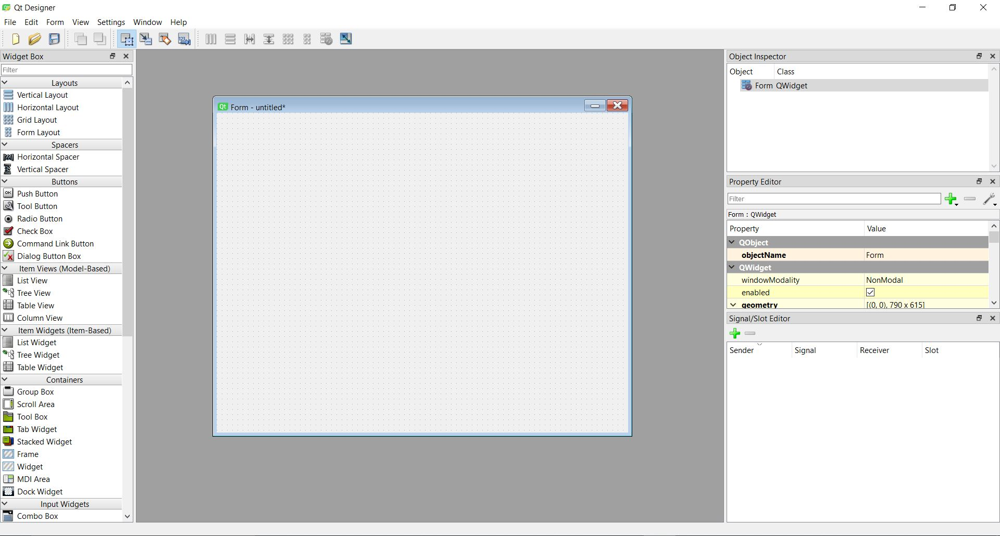
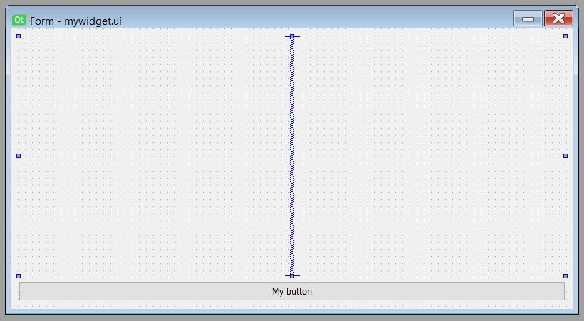
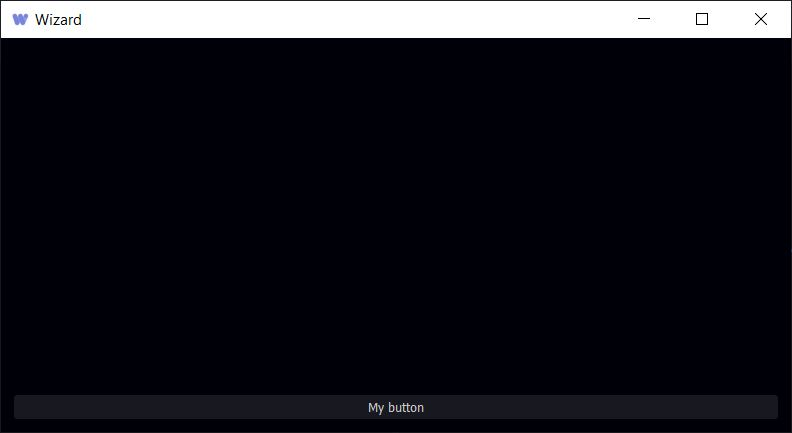

=============================
Introduction to the GUI build
=============================

The wizard gui is built with the python module `PyQt 5.11.3 <https://pypi.org/project/PyQt5/>`_

The gui are basically created with the Designer.exe application comming with the install of PyQt5.

When you save your file it creates a ".ui" file that you need to convert in ".py" file using the pyuic5 pyqt script in the command line::

    pyuic5 -x my/path/to/file.ui -o my/path/to/file.py

Let's create a wizard compatible widget
^^^^^^^^^^^^^^^^^^^^^^^^^^^^^^^^^^^^^^^

First, let's create a simple widget using the Qt Designer

And save it to "$INSTALLDIR/App/gui/ui_files/mywidget.ui", then convert it to a ".py" file::

    pyuic5 -x $INSTALLDIR/App/gui/ui_files/mywidget.ui -o $INSTALLDIR/App/gui/mywidget.py

.. note:: The .py files created from the Qt Designer are stored here : $INSTALLDIR/App/gui/

Once you've created the ".py" file, create a new python file here : "$INSTALLDIR/App/mywidget_widget.py"

On this new script, import the PyQt5 modules::

    # PyQt5 modules
    from PyQt5 import QtWidgets, QtCore, QtGui
    from PyQt5.QtWidgets import QApplication

    # Python modules
    import sys

    # Wizard modules
    from gui import build
    from wizard.vars import defaults

Then import the ".py" file stored in $INSTALLDIR/App/gui::

    from gui.mywidget import Ui_Form

And finally init the widget::

    class Main(QtWidgets.QWidget):

        def __init__(self):

            # Init the "super" function
            super(Main, self).__init__()

            # Build the ui from ui converted file
            self.ui = Ui_Form()
            self.ui.setupUi(self)

If you want that your widget automatically shows when you launch your script, end your code with that::
    
    # If the script is directly launched and not called from another python script
    if __name__ = __main__:

        # Create a PyQt5 application instance
        app = QtWidgets.QApplication(sys.argv)

        # Add the wizard icon to your ui
        app.setWindowIcon(QtGui.QIcon(defaults._wizard_ico_))

        # Launch the widget with the wizard "build" module
        build.launch_normal(Main)

Finally the full mywidget_widget.py script ::

    # PyQt5 modules
    from PyQt5 import QtWidgets, QtCore, QtGui
    from PyQt5.QtWidgets import QApplication

    # Python modules
    import sys

    # Wizard modules
    from gui import build
    from wizard.vars import defaults

    # Call the .py file created from the .ui file
    from gui.mywidget import Ui_Form

    class Main(QtWidgets.QWidget):

        def __init__(self):

            # Init the "super" function
            super(Main, self).__init__()

            # Build the ui from ui converted file
            self.ui = Ui_Form()
            self.ui.setupUi(self)

    # If the script is directly launched and not called from another python script
    if __name__ == '__main__':

        # Create a PyQt5 application instance
        app = QtWidgets.QApplication(sys.argv)

        # Add the wizard icon to your ui
        app.setWindowIcon(QtGui.QIcon(defaults._wizard_ico_))

        # Launch the widget with the wizard "build" module
        build.launch_normal(Main)

Now let's try to launch this widget, verify that the wizard python ($INSTALLDIR/Python/python37/) is in you environments variables

Your widget should appear with the wizard "theme"

The "build" wizard module
^^^^^^^^^^^^^^^^^^^^^^^^^

The wizard "build" module is used to wrap the guis to the wizard style and call some windows attributes to show the uis.

It contains some functions :

- build.launch_normal( widget )
    - This function launch the requested widget with the wizard "theme"

- build.launch_normal_as_child( widget )
    - This function launch the requested widget with the wizard "theme"
    - Doesn't create a main application instance, you need to use this function from another ui script

- build.launch_normal_as_child_frameless( widget )
    - This function launch the requested widget with the wizard "theme"
    - This widget will be launched without the "windows" frame style
    - Doesn't create a main application instance, you need to use this function from another ui script

- build.launch_normal_as_child_frameless_ontop( widget )
    - This function launch the requested widget with the wizard "theme"
    - This widget will be launched without the "windows" frame style
    - This widget will stay on top of other windows
    - Doesn't create a main application instance, you need to use this function from another ui script

- build.launch_dialog_as_child( dialog_widget )
    - This function launch the requested dialog_widget with the wizard "theme"
    - It returns the success or the fail of this dialog_widget
    - This widget will stay on top of other windows
    - Doesn't create a main application instance, you need to use this function from another ui script

- build.launch_dialog_as_child_frameless( dialog_widget )
    - This function launch the requested dialog_widget with the wizard "theme"
    - It returns the success or the fail of this dialog_widget
    - This dialog_widget will be launched without the "windows" frame style
    - This widget will stay on top of other windows
    - Doesn't create a main application instance, you need to use this function from another ui script